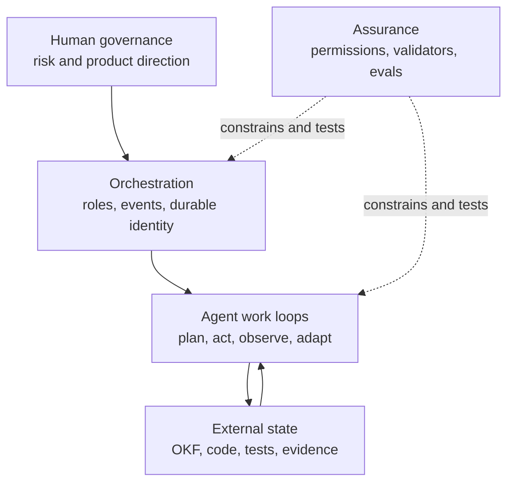
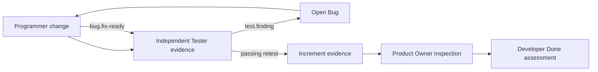

# Agentic Architecture and Design Principles

AAF does not reproduce one research architecture verbatim. It combines established patterns into a runtime-neutral, Scrum-oriented control system. The important distinction is between a **conceptual relative**, an **implemented framework contract**, and a capability the **runtime must supply**.

## Compact map

| Principle | Established relative | AAF realization | Fit |
|---|---|---|---|
| Tool-grounded action loops | ReAct | Inspect state, act through permitted tools, evaluate observable results | Adapted |
| Explicit planning and replanning | Plan-and-Solve | Sprint Goal, Developer Plan, and adaptation after meaningful evidence | Adapted |
| Role-specialized collaboration | CAMEL, MetaGPT, AutoGen | Real role agents, selectable interaction transport, and on-demand Scrum Master facilitation | Direct |
| Event-driven durable orchestration | Conversational agents, graph workflows | Host-owned lifecycle routing, preserved role identifiers, inspectable transitions | Contract; runtime executes |
| Externalized memory and context control | MemGPT | OKF artifacts, indexes, resumable state, progressive loading | Adapted |
| Critique and iterative correction | Reflexion, Self-Refine | Independent tests, product inspection, bug-fix-retest loops, Retrospective | Structural adaptation |
| Human oversight and authority | Human-in-the-loop governance | Product direction, overrides, review feedback, risky-action confirmation | Direct |
| Least privilege and fail-closed boundaries | Trustworthy AI governance | Manifest permissions, separation of duties, blocked transitions | Direct |
| Structured artifacts and guardrails | Schema enforcement | YAML manifests, OKF frontmatter, validators, deterministic checks | Direct |
| Observable and attributable execution | Accountable and transparent AI | Provenance, stable identities, preserved evidence, linked changes | Direct |
| Evaluation-driven assurance | AgentBench, SWE-bench | Critical behavioral cases, end-to-end traces, proportional commit/release gates | Direct |
| Modular skills and controlled learning | Voyager skill library | Reusable skills and human-reviewed `.aafe` improvements | Related, not autonomous |

## 1. Tool-grounded action loops

ReAct interleaves reasoning with actions and observations from an environment.[^react] AAF adopts the **observable control loop**, not a requirement to expose private chain-of-thought:

1. inspect the current event, files, constraints, and uncertainty;
2. choose an action within the role's permissions;
3. execute or delegate through the runtime;
4. inspect tool output, tests, artifacts, or another agent's evidence; and
5. update the plan or surface a blocker.

Examples include the Product Owner's [start-or-resume loop](https://github.com/se-keller/agile-agentic-framework/blob/main/skills/agent-core-skills/product-owner-core/SKILL.md), continuous Developer adaptation in [developer-core](https://github.com/se-keller/agile-agentic-framework/blob/main/skills/agent-core-skills/developer-core/SKILL.md), and the Tester's evidence classifications in [tester-core](https://github.com/se-keller/agile-agentic-framework/blob/main/skills/agent-core-skills/tester-core/SKILL.md). Generic automatic retry or exception repair is **not** specified; recoverable failures become evidence, Bugs, blockers, or a new deliberate action.

## 2. Explicit planning and replanning

Plan-and-Solve separates task decomposition from execution.[^plan-and-solve] AAF uses the same broad idea at a workflow level: the team agrees on a Sprint Goal, Developers create a technical plan, and that plan changes after meaningful discoveries. The [Sprint Planning workflow](https://github.com/se-keller/agile-agentic-framework/blob/main/skills/run-sprint-cycle/references/plan-sprint.md) constrains who decides product value and who decides implementation; [developer-core](https://github.com/se-keller/agile-agentic-framework/blob/main/skills/agent-core-skills/developer-core/SKILL.md) requires continuous replanning.

This is not a claim that every agent uses the Plan-and-Solve prompting technique internally.

## 3. Role-specialized multi-agent collaboration

CAMEL studies role-playing communication, MetaGPT encodes role-specific operating procedures, and AutoGen models configurable conversations among tool-using agents.[^camel][^metagpt][^autogen] AAF realizes this pattern with separate runtime agents, manifests, core skills, permissions, and accountabilities.

The [workspace host contract](https://github.com/se-keller/agile-agentic-framework/blob/main/skills/bootstrap-product-development/assets/product-development-skeleton/AGENTS.md) requires real delegation and stable agent identifiers. The [interaction skill](https://github.com/se-keller/agile-agentic-framework/blob/main/skills/manage-role-interaction/SKILL.md) lets the human choose host presentation, transparent proxy, or native direct handoff when the runtime supports it. These modes change transport, not the role boundaries enforced by manifests. Collaboration must not collapse independent perspectives into one simulated context.

## 4. Event-driven durable orchestration

Modern graph runtimes make control flow, persistence, interruption, and resumption explicit.[^langgraph] AAF defines the portable protocol rather than a vendor graph: the infrastructure-only host applies the [Sprint-cycle router](https://github.com/se-keller/agile-agentic-framework/blob/main/skills/run-sprint-cycle/SKILL.md), preserves each runtime agent identifier, and emits transitions only after inspecting evidence. Scrum Master facilitation remains a separate on-demand role judgment.

AAF does not itself provide the process engine. A compatible runtime must create, resume, and route real agents; if it cannot, the transition stops instead of being simulated.

## 5. Externalized memory and progressive context

MemGPT motivates tiered memory for work that exceeds one context window.[^memgpt] AAF uses a simpler filesystem form: durable OKF artifacts, indexes, code, test evidence, and lifecycle state remain inspectable across conversations. Agents load indexes and directly relevant state first, then one event-specific workflow when needed.

This is **not** an automatic Sprint-boundary conversation reset. Within a run, AAF deliberately resumes the same role agent where continuity matters and keeps only one user-facing conversational owner at a time. The durable source of shared truth is the workspace, not an assumption that chat history or a native handoff remains permanent.

## 6. Independent critique and iterative correction

Reflexion uses linguistic feedback stored in episodic memory, while Self-Refine uses feedback from the same model to revise its own output.[^reflexion][^self-refine] AAF implements a related but structurally different loop:

The [test-finding workflow](https://github.com/se-keller/agile-agentic-framework/blob/main/skills/agent-core-skills/tester-core/references/record-test-finding.md), independent retest, Product Owner inspection, and Sprint Retrospective create feedback at different authority boundaries. AAF does not claim a learned actor-critic, weight update, or mandatory hidden self-reflection loop.

## 7. Human oversight and retained authority

Runtime HITL is different from RLHF: RLHF changes model behavior during training, whereas HITL inserts human decisions into system operation. NIST AI RMF emphasizes explicit human roles, oversight, accountability, and ongoing measurement across the AI lifecycle.[^nist-ai-rmf]

AAF makes the human the source of creative product direction, prioritizes urgent human interaction where configured, requires confirmation for defined risky mutations, supports explicit Product Owner override handling, and includes humans in Review and Retrospective. Human input does not erase role boundaries: a Product Owner still cannot write Product Code.

## 8. Least privilege, separation of duties, and fail-closed behavior

Trustworthy agent systems need explicit responsibility and risk controls, not only capable prompts.[^nist-ai-rmf] AAF declares permissions in each `agent.yaml`; skills may narrow behavior but cannot expand those permissions. Independent evidence is stronger because the Tester cannot silently repair production code and the Product Owner cannot implement the outcome it later inspects.

The host also fails closed: when a required role cannot be started or resumed, it stops that lifecycle transition. It offers only verified interaction capabilities and never silently presents proxying as direct handoff. Missing required evidence blocks Done rather than inviting a plausible host-authored substitute.

## 9. Structured artifacts and validation guardrails

Schema systems separate flexible content from machine-checkable structural constraints.[^json-schema] AAF applies that principle through versioned YAML agent manifests and the [OKF profile](https://github.com/se-keller/agile-agentic-framework/blob/main/skills/okf/SKILL.md). The bundled [OKF validator](https://github.com/se-keller/agile-agentic-framework/blob/main/skills/okf/scripts/validate_okf.py) and [deterministic commit checks](https://github.com/se-keller/agile-agentic-framework/blob/main/evals/run_deterministic_checks.py) catch malformed metadata, links, placeholders, and bootstrap defects.

These are structural guardrails, not proof that a product decision or agent result is correct.

## 10. Observable and attributable execution

An agent system is debuggable and governable only when decisions and effects can be traced. NIST treats accountability and transparency as cross-cutting trustworthiness characteristics and distinguishes builders from evaluators as a best practice.[^nist-ai-rmf]

AAF uses stable artifact and agent identities, OKF `generated` and `verified` provenance, preserved failed-test evidence, explicit lifecycle signals, linked commits and diffs, and Git history. It records observable decisions and evidence without requiring disclosure of private chain-of-thought.

## 11. Evaluation-driven assurance

AgentBench evaluates multi-turn agents in interactive environments, and SWE-bench evaluates software agents against real repositories and executable outcomes.[^agentbench][^swe-bench] Both illustrate why fluent output is insufficient evidence.

AAF keeps evals outside productive prompts and combines:

- deterministic structural checks;
- focused behavioral cases for role and boundary behavior;
- end-to-end traces for cross-agent lifecycle behavior;
- fresh contexts and independent review for critical evidence; and
- proportional commit, integration, and release gates.

The authoritative procedure is the [evaluation guide](https://github.com/se-keller/agile-agentic-framework/blob/main/evals/README.md); the rationale is summarized in [Evaluation Strategy](evaluation-strategy.md).

## 12. Modular skills with controlled evolution

Voyager demonstrates an autonomously growing executable skill library driven by environment feedback and self-verification.[^voyager] AAF shares the modularity idea but not autonomous lifelong learning. Skills are explicit, reviewable `SKILL.md` contracts. Product-specific improvements may be proposed from a Retrospective under `.aafe/`, but require human review before merge; agents do not silently add global capabilities or expand permissions.

## Patterns AAF does not currently claim

| Pattern | Current AAF position |
|---|---|
| Tree-of-Thoughts / Graph-of-Thoughts | Useful reasoning strategies, but AAF neither requires multiple search branches nor exposes a thought graph.[^tree-of-thoughts][^graph-of-thoughts] |
| Autonomous self-healing | Tool failures can inform the next action, but no generic retry, rollback, or exception-repair policy is guaranteed. |
| Autonomous Voyager-style skill acquisition | Skills and `.aafe` improvements are reviewable changes, not self-installed learning. |
| Automatic Sprint context reset | No such lifecycle behavior exists; durable artifacts and stable role identifiers support resumption. |
| One universal actor-critic loop | Critique is distributed across Tester, Product Owner, Developers, Retrospective, validators, and eval reviewers according to authority. |
| Exposed chain-of-thought | AAF requires inspectable decisions, evidence, and actions—not disclosure of private model reasoning. |

[^react]: Yao et al., “ReAct: Synergizing Reasoning and Acting in Language Models,” 2022; published at ICLR 2023.
[^plan-and-solve]: Wang et al., “Plan-and-Solve Prompting,” 2023.
[^reflexion]: Shinn et al., “Reflexion: Language Agents with Verbal Reinforcement Learning,” 2023.
[^self-refine]: Madaan et al., “Self-Refine: Iterative Refinement with Self-Feedback,” 2023.
[^camel]: Li et al., “CAMEL: Communicative Agents for Mind Exploration of Large Language Model Society,” 2023.
[^metagpt]: Hong et al., “MetaGPT: Meta Programming for A Multi-Agent Collaborative Framework,” 2023.
[^autogen]: Wu et al., “AutoGen: Enabling Next-Gen LLM Applications via Multi-Agent Conversation,” 2023.
[^memgpt]: Packer et al., “MemGPT: Towards LLMs as Operating Systems,” 2023.
[^voyager]: Wang et al., “Voyager: An Open-Ended Embodied Agent with Large Language Models,” 2023.
[^tree-of-thoughts]: Yao et al., “Tree of Thoughts: Deliberate Problem Solving with Large Language Models,” 2023.
[^graph-of-thoughts]: Besta et al., “Graph of Thoughts: Solving Elaborate Problems with Large Language Models,” 2023.
[^agentbench]: Liu et al., “AgentBench: Evaluating LLMs as Agents,” 2023.
[^swe-bench]: Jimenez et al., “SWE-bench: Can Language Models Resolve Real-World GitHub Issues?” 2023.
[^nist-ai-rmf]: Tabassi, “Artificial Intelligence Risk Management Framework (AI RMF 1.0),” NIST AI 100-1, 2023.
[^langgraph]: LangChain, “LangGraph overview,” current product documentation consulted 2026-08-26.
[^json-schema]: Wright et al., “JSON Schema: A Media Type for Describing JSON Documents,” Draft 2020-12.
