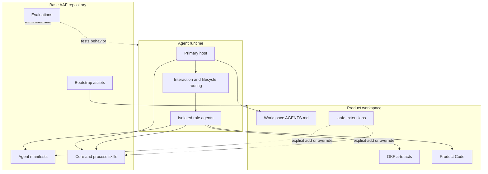
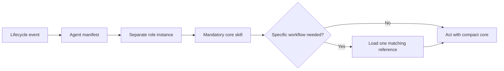
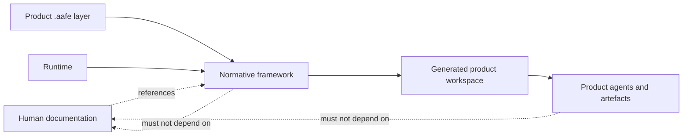

# Architecture

## Architectural overview

AAF separates three concerns that are often mixed in agent systems:

1. **Runtime:** starts, resumes, isolates, and routes real agents.
2. **Framework:** defines reusable roles, permissions, skills, lifecycle rules, and evaluations.
3. **Product workspace:** contains one product's code, knowledge, Sprint state, and explicit extensions.

## The primary host is infrastructure, not a role

The primary agent context coordinates runtime mechanics. It negotiates a supported interaction mode, starts required role agents, stores returned identifiers, routes later human replies to the same instance, inspects lifecycle preconditions, and emits evidence-backed transitions through the Sprint-cycle process skill.

The host must not load a role's core skills or perform product, facilitation, implementation, test, or Done work. Mechanical routing is not Scrum Master evidence. This prevents one conversational context from producing apparently independent decisions while avoiding a permanent Scrum Master dispatcher.

## Session interaction modes

At session entry, the host offers only modes supported by the current runtime:

| Mode | Visible interaction | Required capability |
|---|---|---|
| `host` | Host presents attributable role results and routes replies | Separate resumable role agents |
| `transparent-proxy` | Active role's intended user-facing payload is visibly attributed and forwarded without material rewriting | Host can preserve one active role ID and route the next human turn |
| `direct-handoff` | Active role takes over the same visible conversation and later releases it | Native same-conversation handoff with preserved identity and state |

Exactly one role owns the user-facing channel at a time. Unsupported modes are not offered or silently approximated. The session choice changes message transport only; roles, permissions, artifacts, and lifecycle boundaries remain the same.

## Manifests and skills have different jobs

An [agent manifest](https://github.com/se-keller/agile-agentic-framework/tree/main/agents/) declares stable configuration:

- identity and display name;
- mandatory core skills;
- permissions;
- subscribed lifecycle events; and
- task priority.

A [core skill](https://github.com/se-keller/agile-agentic-framework/tree/main/skills/agent-core-skills/) defines behavioral accountability and operating boundaries. Process skills such as [run-sprint-cycle](https://github.com/se-keller/agile-agentic-framework/blob/main/skills/run-sprint-cycle/SKILL.md) coordinate work across roles without absorbing their decisions. Optional catalog skills add narrowly matched techniques or capabilities—for example, browser-visible WebApp testing—that any catalog-enabled role may apply within its own contract. They never change a role's authority or permissions.

## Roles and authority

| Role | Owns | Must not own |
|---|---|---|
| Product Owner | Product direction, Product Goal, Product Backlog content and order, value | Product Code, technical solution, Done decision |
| Scrum Master | Scrum facilitation, effectiveness, impediments, deviations, Retrospective improvement | Lifecycle routing, agent activation, product priority, task assignment, technical plan, Done decision |
| Programmer | Product Code, implementation, technical decisions, engineering tests | Product value and independent Tester result |
| Tester | Independent test design and evidence, test assets, Bug reporting and retest | Production source changes, unilateral Done decision |
| Stakeholder | Declared perspective, observations, needs, feedback | Product decisions, artifact mutation, technical direction |

Programmer and Tester are specializations of the same Scrum Developer accountability. They share [`developer-core`](https://github.com/se-keller/agile-agentic-framework/blob/main/skills/agent-core-skills/developer-core/SKILL.md) and add specialization-specific contracts.

## Two inspectable planes

AAF uses a control plane and a knowledge/work plane:

- The **control plane** consists of manifests, skills, permissions, runtime identities, events, and lifecycle rules.
- The **knowledge/work plane** consists of OKF artifacts, Product Code, tests, Sprint Backlogs, plans, and evidence.

The control plane determines who may act and when. The knowledge/work plane records what is known and what changed. The documentation bundle sits outside both planes and describes them for people.

Lifecycle events are handoffs, not broadcasts. The host routes them through the Sprint-cycle process without absorbing role judgments. In Sprint Planning, an on-demand Scrum Master facilitates while the Product Owner presents and clarifies one PBI, the Tester contributes business-facing cases, the Programmer plans implementation, and the Tester reviews testability. During delivery, the Programmer hands a testable slice to the Tester, then passing evidence to the Product Owner for inspection. This sequencing preserves independent perspectives without allowing premature execution.

## Runtime neutrality

AAF names required capabilities—real agent activation, resumable identifiers, message and lifecycle routing, permissions, inspectable files, and optional same-conversation handoff—without prescribing a vendor API. A conforming runtime maps those concepts to its own native mechanism and advertises only interaction modes it can actually provide.

This neutrality has a limit: if a runtime cannot create or resume a required separate agent, AAF stops that transition. It does not fall back to role simulation.

## Dependency direction

The dashed lines toward documentation are explanatory only. Removing `docs/` must not change agent behavior.
