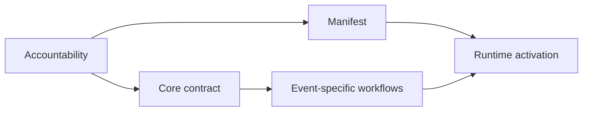

# Building an Agent Framework

AAF is one concrete design, not a universal recipe. The following sequence captures the reusable engineering lessons behind it.

## 1. Start with decision boundaries, not agent names

Define which decisions must remain independent. Ask:

- Who determines product value?
- Who chooses technical solutions?
- Who produces independent evidence?
- Who controls process without controlling domain decisions?
- Which decisions require a human?

Create separate agents only where different authority, context, tools, evidence, or independent facilitation justifies the boundary. A deterministic router is infrastructure rather than a role; a Scrum Master becomes a separate agent when coaching, impediment handling, facilitation, or improvement needs judgment.

## 2. Separate configuration from behavior

Use a small machine-readable manifest for identity, permissions, subscriptions, and required skills. Keep behavioral contracts readable and reviewable. Avoid copying full instructions into every role.

## 3. Design the runtime boundary explicitly

A multi-agent design needs more than role prompts. Specify that the runtime must:

- create a genuinely separate context;
- return a stable identifier;
- resume the same context;
- route events and human replies;
- advertise supported user-interaction modes and preserve one active conversational owner;
- execute deterministic lifecycle mechanics without absorbing role judgment;
- expose activation failure; and
- prevent the host from impersonating the missing role.

Without these properties, a framework may look multi-agent while remaining one model context with role labels. Treat native direct handoff as an optional capability: host-mediated and transparent-proxy modes can remain portable, but a runtime must never claim a handoff it cannot perform.

## 4. Give every role least authority

Permissions should follow accountability. Independent evaluation becomes weak if the evaluator can silently change what it evaluates. Orchestration becomes management if the orchestrator can make every downstream decision.

Test negative boundaries, not only successful work.

## 5. Persist state outside model memory

Choose an inspectable representation for goals, work, decisions, plans, results, and errors. Stable IDs and indexes matter more than elaborate storage technology.

Define authoritative locations and movement rules so that two files cannot silently claim to be the current PBI, Bug, or decision.

## 6. Make transitions explicit

Represent lifecycle changes as observable events with preconditions and evidence. A transition should answer:

- What state are we leaving?
- Who is accountable for the decision?
- What evidence is required?
- What artifact changes?
- What happens if a role or evidence is unavailable?

## 7. Load context only when it becomes relevant

Large prompts are not automatically safer. Keep universal role invariants in a compact core and route to detailed workflows by event. Evaluate the routing itself.

## 8. Separate product extensions from framework evolution

Give products a local extension layer. Require explicit declaration of additions and overrides. Promote a pattern into the base framework only after it proves reusable.

## 9. Build an evaluation pyramid

Use cheap deterministic checks for structure and a small number of behavioral cases for semantic boundaries. Reserve full matrices for releases or deliberate runtime/model comparisons.

Always preserve actual traces: agent IDs, tool calls, diffs, tests, artifacts, and lifecycle signals. A polished final answer is insufficient evidence by itself.

## 10. Keep explanations outside the operating contract

Human documentation may include rationale, diagrams, examples, and teaching material. Agents should still be able to operate from a smaller normative contract. This avoids paying the context cost of the manual on every run and prevents prose explanations from becoming accidental behavior.

## A minimal implementation order

1. One role boundary and one manifest.
2. One compact core skill.
3. One persistent artifact and validator.
4. One real runtime activation with stable identity.
5. One handoff between two accountable agents.
6. One negative permission or boundary test.
7. One end-to-end trace.
8. Only then add more roles, workflows, and extensions.

This order keeps architecture driven by demonstrated needs rather than speculative infrastructure.
