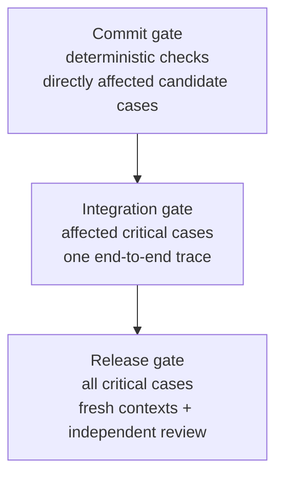

# Evaluation Strategy

Agent behavior is nondeterministic, but running the complete behavioral suite before every small commit is expensive. AAF uses proportional gates.

## Commit gate

Before every commit:

1. Run `python evals/run_deterministic_checks.py`.
2. Select only behavioral cases directly affected by the diff.
3. Run semantic candidates once in a fresh context.
4. Stop the commit if a required result is failed, blocked, or inconclusive.

The deterministic runner checks the full staged and unstaged commit diff, repository YAML, local Markdown links, a fresh bootstrap, unresolved placeholders, and OKF validity. It also validates this documentation bundle.

## Integration gate

Changes to a shared role boundary, permission, Done rule, or Sprint lifecycle add one focused end-to-end trace that crosses the changed boundary.

For example, a multi-agent lifecycle change should demonstrate real and distinct Product Owner, Programmer, and Tester identifiers, plus a preserved Scrum Master identity whenever facilitation is required. It should show that the host owns only mechanical routing and transitions and should reach an independent test result without repeating unrelated role cases merely to increase the evidence count.

Interaction capability cases are evaluated against the selected runtime. Unsupported direct handoff requires a passing fail-closed gating case; its positive handoff case remains not applicable until a capable runtime is used and must never be reported as passed without an actual transfer trace.

## Release gate

Before a release or major milestone, run the complete critical suite in fresh contexts and obtain independent review. This is the right place for broader runtime and model coverage.

## Baselines

Ordinary commits reuse the latest accepted report. Re-run an unchanged baseline only for:

- runtime or model comparison;
- a claimed token, cost, latency, or activation improvement; or
- a selected comparison without an accepted reference result.

New or revised cases receive human review and a calibrated candidate run; they do not automatically trigger a full baseline replay.

## What each kind of evidence proves

| Evidence | Strong at | Cannot prove alone |
|---|---|---|
| Deterministic check | Structure, syntax, links, repeatable validators | Semantic role behavior |
| Behavioral case | Response and tool behavior in one situation | Universal correctness |
| End-to-end trace | Cross-role activation, routing, and lifecycle | Every edge case |
| Independent review | Detecting author bias and rubric gaps | Runtime determinism |
| Human acceptance | Governance and fitness for purpose | Future behavior without continued evaluation |

## Documentation maintenance

A semantic change reviews the [documentation map](index.md#documentation-map). The affected concept is updated, or the evaluation report records why it is unaffected. The commit check validates structure and links; it does not replace semantic review.

The normative procedure lives in the [evaluation guide](https://github.com/se-keller/agile-agentic-framework/blob/main/evals/README.md).
