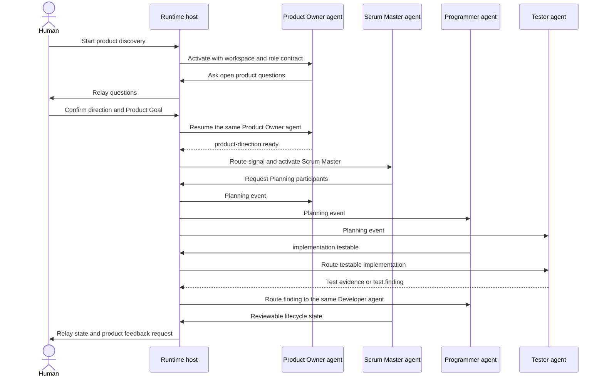

# Framework Guide

## What AAF provides

AAF is a small, runtime-neutral set of agent roles, role skills, Scrum lifecycle rules, workspace templates, and evaluations. It does not contain a model runtime or a product implementation.

You provide an agent runtime capable of starting real, resumable agents. AAF supplies the contracts that tell those agents what they are accountable for, what they may change, and how they collaborate.

## Start a product

From the framework repository, run the [bootstrap script](https://github.com/se-keller/agile-agentic-framework/blob/main/skills/bootstrap-product-development/scripts/bootstrap.py):

```bash
python3 skills/bootstrap-product-development/scripts/bootstrap.py "My Product" --parent ../
```

The new workspace contains:

- `README.md` for people;
- `AGENTS.md` for the runtime host and agents;
- `product-code/` for implementation;
- `artefacts/` for OKF product knowledge and Scrum results; and
- `.aafe/` for explicit product-specific framework extensions.

Then ask the runtime to start the Product Owner:

> Start the Product Owner for this product. Inspect the existing artifacts and Product Code first, then continue product discovery with me.

The runtime host starts a real Product Owner agent and relays its questions. Later answers return to that same agent instance.

## Typical interaction



The arrows show responsibility and host-mediated message flow, not direct authority. The Scrum Master facilitates; it does not assign technical work. Developers pull and coordinate work themselves.

## What to inspect during a run

- Product direction and available work under `artefacts/product-backlog/`.
- The active Sprint Goal and selected items under `artefacts/sprints/<sprint>/sprint-backlog/`.
- The evolving `developer-plan.md`.
- Product Code and tests under `product-code/`.
- Increment evidence under `artefacts/increment-documentation/`.
- Agent identifiers and lifecycle events in the runtime trace.

The filesystem is deliberately inspectable. It allows a human or resumed agent to understand current state without depending on hidden conversation memory.

## Extend one product without forking AAF

Put product-specific agents, skills, rules, or deliberate overrides under `.aafe/` and declare them in `.aafe/aafe.yaml`. An undeclared same-name collision is an error.

Change the base repository only for a runtime-neutral defect or reusable improvement. Product Code and product knowledge never belong in the framework repository.

## Common failure modes

| Symptom | Meaning | Response |
|---|---|---|
| The host answers as the Product Owner | A role was simulated instead of activated | Stop and require a real role agent |
| A later answer reaches a new agent | Agent identity was not preserved | Route through the stored runtime identifier |
| Scrum Master assigns coding tasks | Developer self-management was crossed | Return planning and work selection to Developers |
| Tester edits production source | Independent test boundary was crossed | Restore the source and route the finding to a Programmer |
| Open Bug is called a limitation | Done evidence is being bypassed | Keep delivery active until fix and independent retest |
| Product-specific change edits AAF | Framework and product layers were mixed | Move the change into the product's `.aafe/` layer |

## Where the truth lives

This guide helps people. Normative behavior lives in [`AGENTS.md`](https://github.com/se-keller/agile-agentic-framework/blob/main/AGENTS.md), [agent manifests](https://github.com/se-keller/agile-agentic-framework/tree/main/agents/), and [skills](https://github.com/se-keller/agile-agentic-framework/tree/main/skills/). If this guide conflicts with those files, the normative contracts win and this documentation must be corrected.
