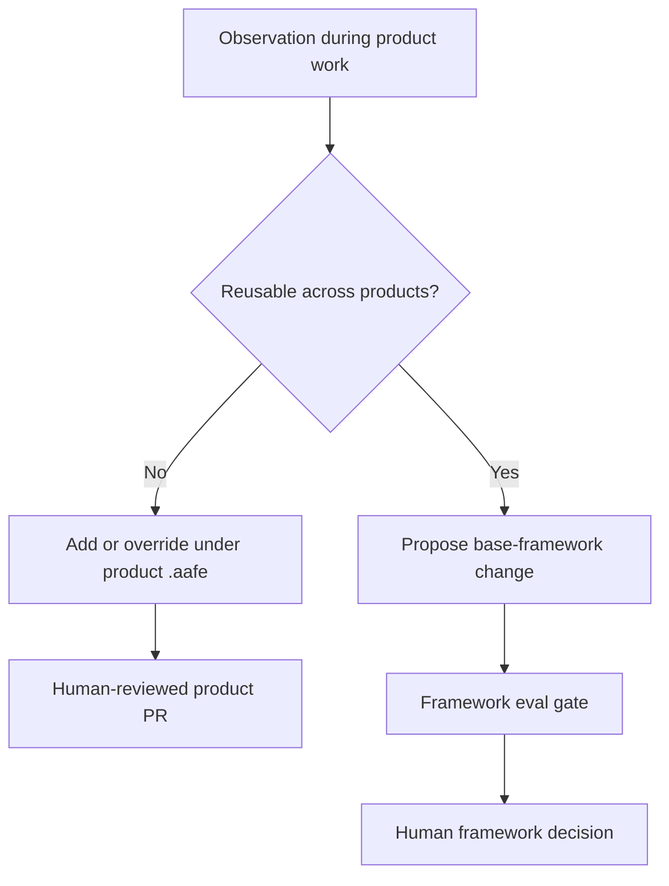
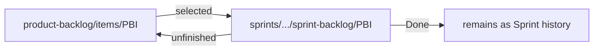

# Repository and Extension Model

## Base framework repository

```text
agile-agentic-framework/
├── AGENTS.md                  # normative repository entry point
├── agents/                    # runtime-neutral role manifests
├── skills/
│   ├── agent-core-skills/     # mandatory role contracts
│   ├── bootstrap-product-development/
│   ├── okf/
│   └── run-sprint-cycle/
├── evals/                     # behavior and commit evidence
└── docs/                      # non-normative human explanation
```

The base repository contains reusable behavior only. Its `AGENTS.md`, manifests, and skills are normative. This documentation is not.

## Product workspace

```text
product-development-example/
├── README.md                  # human entry point
├── AGENTS.md                  # agent/runtime entry point
├── .aafe/
│   └── aafe.yaml              # explicit additions and overrides
├── product-code/              # source, tests, technical files
└── artefacts/                 # OKF product and Sprint knowledge
    ├── product-backlog/
    ├── sprints/
    ├── increment-documentation/
    └── retrospectives/
```

One product workspace corresponds to one independently managed product boundary, Product Goal, and Product Backlog. Technical modules do not automatically become separate product workspaces.

## Why the repositories are separate

Product experimentation often reveals framework improvements. Keeping repositories separate prevents a product-specific shortcut from silently becoming a global rule.



## Explicit extension rules

- Add product-specific agents under `.aafe/agents/`.
- Add product-specific skills under `.aafe/skills/`.
- Declare every addition or override in `.aafe/aafe.yaml`.
- Treat undeclared name collisions as errors.
- Never infer an override merely because two files share a name.
- Keep the base framework read-only during ordinary product work.

This makes extension reviewable. A maintainer can tell which behavior came from AAF and which behavior belongs only to one product.

## Product knowledge versus Product Code

`artefacts/` contains human- and agent-readable knowledge and evidence. `product-code/` contains executable implementation and technical files. Increment Documentation describes and links Product Code; it does not contain the code itself.

Role permissions reinforce this separation. For example, the Product Owner may inspect Product Code but cannot change it, while the Programmer may change Product Code and the Tester may write test assets but not production source.

## Authoritative movement, not duplication

AAF moves authoritative work artifacts as their workflow state changes:



Stable IDs and frozen filenames preserve identity. Indexes keep links and current ordering inspectable. Git history preserves the movement.
