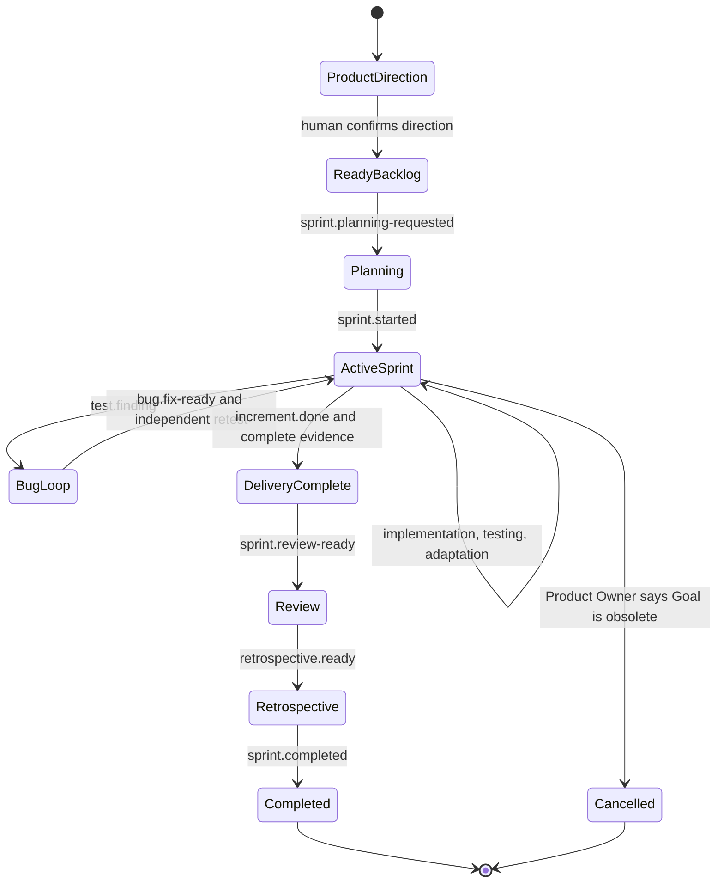
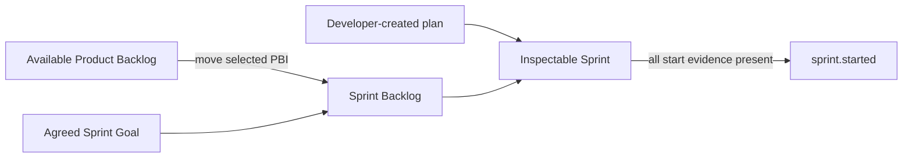

# Sprint Lifecycle

AAF adapts Scrum for autonomous agent execution by using explicit lifecycle events instead of a calendar timebox. The adaptation is declared in the [Sprint-cycle skill](https://github.com/se-keller/agile-agentic-framework/blob/main/skills/run-sprint-cycle/SKILL.md); Scrum accountability boundaries remain intact.

## State model

## 1. Product direction and readiness

The Product Owner collaborates with the human to establish a Product Vision and one current Product Goal. The Product Backlog is ordered, and at least one PBI must satisfy the Definition of Ready before Planning begins.

Human confirmation is required before the first affected Sprint Planning. The Scrum Master must not invent missing product direction or capacity.

## 2. Sprint Planning

The runtime makes Product Owner and configured Developers available as separate agents. The Scrum Master facilitates:

- Product Owner explains value and presents the highest ordered ready work.
- Developers forecast what they can complete.
- The Scrum Team and human establish one Sprint Goal.
- Developers create the technical plan and testing approach.

Only then is the Sprint directory created. Selected PBI files move—without duplication—from the Product Backlog into the Sprint Backlog.

## 3. Delivery loop

The Scrum Master signals that work is available. Developers pull work and coordinate their plan. Product questions go to the Product Owner; technical choices stay with Developers.

Testing begins as soon as a meaningful slice exists. A confirmed defect creates an open Bug at the top of the Sprint Backlog and emits `test.finding`. A Programmer fixes production code and emits `bug.fix-ready`; the Tester independently retests the same Bug.

Safe work may continue around a blocker. The framework exposes impediments rather than repeatedly polling or pretending blocked work is complete.

## 4. Done and delivery completion

Developers collectively determine Done after:

- required tests pass;
- known Bugs are resolved and independently retested;
- Increment Documentation exists;
- Product Owner assessment is recorded; and
- every Definition of Done criterion has evidence.

One Developer, the Product Owner, or the Scrum Master cannot declare Done alone. Product assessment, Done, release, and demonstration are separate decisions.

If work remains unfinished at Sprint end, its authoritative file returns to the Product Backlog. The completed Sprint Backlog retains a link and rationale, not a duplicate.

## 5. Review, Retrospective, and completion

Sprint Review inspects the outcome and adapts future product work. It is not an acceptance gate. Retrospective examines quality, flow, collaboration, agent behavior, rules, and tools.

The Scrum Master emits `sprint.completed` only after Review and Retrospective records exist and all remaining Sprint Backlog artifacts are Done or resolved. Completion returns control to Product Backlog stewardship and stops. Ready work does not automatically start another Sprint.

## Ownership by phase

| Phase | Product Owner | Developers | Scrum Master | Human and stakeholders |
|---|---|---|---|---|
| Direction | Owns product intent and backlog | Advise on feasibility when needed | Facilitates clarity | Human provides creative direction; stakeholders provide input |
| Planning | Explains value and ordered work | Forecast, plan, and choose technical approach | Facilitates and checks readiness | Collaborate on Sprint Goal |
| Delivery | Answers product questions | Implement, test, integrate, adapt plan | Exposes flow and impediments | Provide decisions when requested |
| Done | Records product assessment | Collectively apply Definition of Done | Verifies state, never decides Done | Release remains a human decision |
| Review | Adapts Product Backlog | Demonstrate and discuss evidence | Facilitates | Inspect and provide feedback |
| Retrospective | Participates as Scrum Team | Participate as Scrum Team | Facilitates improvement | Human may participate |
