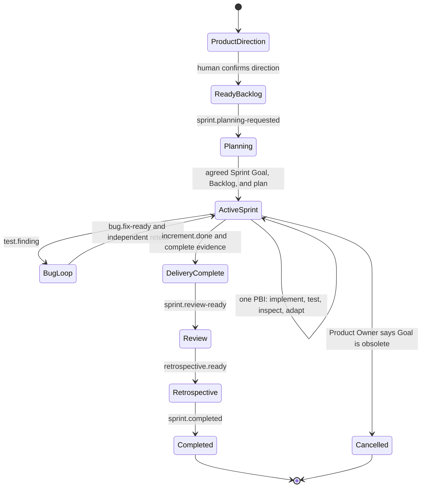
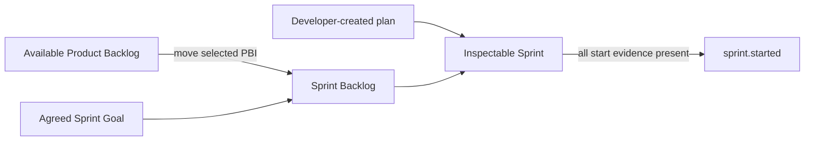

# Sprint Lifecycle

AAF adapts Scrum for autonomous agent execution by using explicit lifecycle events instead of a calendar timebox. The adaptation is declared in the [Sprint-cycle skill](https://github.com/se-keller/agile-agentic-framework/blob/main/skills/run-sprint-cycle/SKILL.md); Scrum accountability boundaries remain intact.

## State model

## 1. Product direction and readiness

The Product Owner collaborates with the human to establish the Product Vision through [Roman Pichler's Product Vision Board](https://www.romanpichler.com/blog/the-product-vision-board/) in its simple or extended form. The human chooses the variant after a short explanation, then works through one field at a time with the Product Owner. The resulting OKF artifact keeps validated knowledge, assumptions, and validation needs visible in portable Markdown tables and may add explanatory detail below them.

After the board is confirmed, the Product Owner uses it to establish one concrete current Product Goal. The goal advances the Product Vision and should generate evidence for important board hypotheses. The Product Backlog is ordered, and at least one PBI must satisfy the Definition of Ready before Planning begins.

Human confirmation is required before the first affected Sprint Planning. The Scrum Master must not invent missing product direction or capacity.

## 2. Sprint Planning

The runtime activates separate agents at the handoff where their perspective is needed; it does not broadcast Planning to every role. The Scrum Master facilitates this PBI-wise sequence for each candidate:

1. The Product Owner first checks whether the current Product Goal has been achieved, establishes the next one with the human if necessary, orders the Product Backlog, and presents one PBI.
2. Programmer and Tester ask understanding questions; the Product Owner clarifies and updates the PBI's product knowledge.
3. The Tester adds business-facing test cases and examples to the pending plan.
4. The Programmer adds its implementation approach, automated acceptance-test coverage, engineering tests, risks, dependencies, and sequence.
5. The Tester reviews the implementation plan for testability and adds material risks or gaps.

No implementation or test execution occurs during these Planning steps. Once every candidate has been clarified, the Product Owner proposes the value-focused selection and Sprint Goal. Developers collectively forecast feasibility and agree or request changes. The Scrum Team establishes the final Goal together; the Scrum Master facilitates but never proposes its product content.

Only then is the Sprint directory created. The pending plan becomes `developer-plan.md`, and selected PBI files move—without duplication—from the Product Backlog into the Sprint Backlog.

## 3. Delivery loop

Developers pull one unblocked PBI at a time. The Programmer implements it, including unit, integration, and automated acceptance tests, and signals `implementation.testable` only after a meaningful slice is available. The Tester then independently executes the planned business-facing checks plus suitable UI and exploratory testing; it never starts execution merely because the Sprint began.

A confirmed defect creates an open Bug at the top of the Sprint Backlog and emits `test.finding`. A Programmer fixes production code and emits `bug.fix-ready`; the Tester independently retests the same Bug. Under the Zero Bug Policy, every Bug discovered in an active Sprint blocks Done and is resolved before normal work continues. If a cancelled or explicitly unfinished Sprint returns it to the Product Backlog, the Product Owner orders it very highly for the next Sprint; the unfinished work is never reported Done.

After passing independent Tester evidence, Developers prepare Increment Documentation and the Product Owner inspects the usable Increment. Product feedback becomes new or updated Product Backlog Items; it is not an approval gate. After the Developers collectively determine Done, the next PBI may begin. The framework exposes impediments rather than repeatedly polling or pretending blocked work is complete.

## 4. Done and delivery completion

Developers collectively determine Done after:

- required tests pass;
- known Bugs are resolved and independently retested;
- Increment Documentation exists;
- Product Owner assessment is recorded; and
- every Definition of Done criterion has evidence.

One Developer, the Product Owner, or the Scrum Master cannot declare Done alone. Product assessment, Done, release, and demonstration are separate decisions.

If work remains unfinished at Sprint end, its authoritative file returns to the Product Backlog. The completed Sprint Backlog retains a link and rationale, not a duplicate.

## 5. Review, Retrospective, and completion

Sprint Review states the Sprint Goal and its outcome, lists completed PBIs, explains how the human can try the Increment, and asks two or three concrete feedback questions. The Product Owner records resulting changes as new or updated Product Backlog Items. Review is not an acceptance gate. Retrospective lets each participating agent briefly identify what worked and propose improvement; it also asks the human about desired changes before selecting process or `.aafe` improvements.

The Scrum Master emits `sprint.completed` only after Review and Retrospective records exist and all remaining Sprint Backlog artifacts are Done or resolved. Completion returns control to Product Backlog stewardship and stops. Ready work does not automatically start another Sprint.

## Ownership by phase

| Phase | Product Owner | Developers | Scrum Master | Human and stakeholders |
|---|---|---|---|---|
| Direction | Owns product intent and backlog | Advise on feasibility when needed | Facilitates clarity | Human provides creative direction; stakeholders provide input |
| Planning | Orders and presents PBIs, clarifies intent, proposes selection and Goal | Tester plans business-facing cases; Programmer plans implementation and automated tests; Developers forecast | Facilitates the PBI-wise handoffs and checks readiness; never proposes the Goal | Collaborate on final Sprint Goal |
| Delivery | Answers product questions and inspects usable Increment | Programmer implements and runs automated tests; Tester independently runs UI and exploratory tests, records/retests Bugs; Developers adapt plan | Exposes flow and impediments | Provide decisions when requested |
| Done | Records product assessment | Collectively apply Definition of Done | Verifies state, never decides Done | Release remains a human decision |
| Review | Adapts Product Backlog | Demonstrate and discuss evidence | Facilitates | Inspect and provide feedback |
| Retrospective | Participates as Scrum Team | Participate as Scrum Team | Facilitates improvement | Human may participate |
